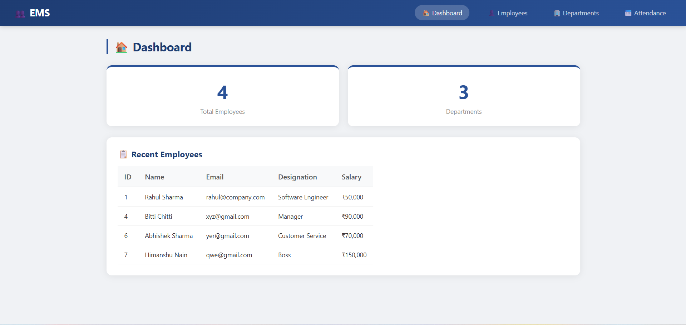
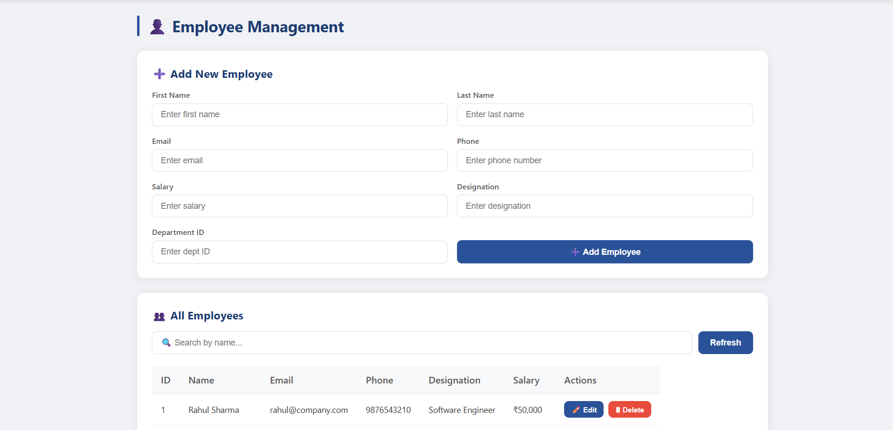

# Employee Management System

A web-based Employee Management System built with **Core Java** and **MySQL**, featuring a built-in HTTP server — no frameworks required.

## Features

- 👤 **Employee Management** — Add, update, delete, and search employees
- 🏢 **Department Management** — Create and manage departments
- 📅 **Attendance Tracking** — Mark attendance and check attendance percentage
- 🏠 **Dashboard** — Overview of total employees and departments
- 🌐 **Web Interface** — Clean and responsive UI accessible from the browser

## Tech Stack

- **Language:** Java 17
- **Server:** `com.sun.net.httpserver.HttpServer` (built-in Java HTTP server)
- **Database:** MySQL
- **Build Tool:** Maven
- **Frontend:** HTML, CSS, JavaScript (served directly from Java)

## Project Structure

```
EmployeeManagementSystem/
├── src/
│   └── main/
│       └── java/
│           └── com/employee/
│               ├── AppServer.java        # Main HTTP server & all route handlers
│               ├── App.java              # Entry point placeholder
│               ├── dao/
│               │   ├── EmployeeDAO.java  # Employee DB operations
│               │   ├── DepartmentDAO.java# Department DB operations
│               │   └── AttendanceDAO.java# Attendance DB operations
│               ├── model/
│               │   ├── Employee.java     # Employee model
│               │   └── Department.java   # Department model
│               ├── main/
│               │   └── MainMenu.java     # CLI menu (optional)
│               └── util/
│                   └── DBConnection.java # MySQL connection utility
├── pom.xml
└── employees.csv
```

## Prerequisites

- Java 17+
- MySQL 8.0+
- Maven 3.6+

## Setup & Run

### Prerequisites
Make sure these are installed on your machine:
- [Java 17+](https://www.oracle.com/java/technologies/downloads/)
- [Maven 3.6+](https://maven.apache.org/download.cgi)
- [MySQL 8.0+](https://dev.mysql.com/downloads/installer/)
- [Git](https://git-scm.com)

---

### Option 1 — Auto Setup (Windows)

1. Download and run `setup.bat` — it does everything automatically:
   - Clones the repo
   - Builds the project
   - Creates the database
   - Starts the server and opens the browser

```bash
curl -O https://raw.githubusercontent.com/Himanshunain224/EmployeeManagementSystem/main/setup.bat && setup.bat
```

---

### Option 2 — Manual Setup

**1. Clone the repository**
```bash
git clone https://github.com/Himanshunain224/EmployeeManagementSystem.git
cd EmployeeManagementSystem
```

**2. Create the MySQL database**
```sql
CREATE DATABASE employee_db;
```

**3. Update DB credentials**

Open `src/main/java/com/employee/util/DBConnection.java` and update:
```java
private static final String URL = "jdbc:mysql://localhost:3306/employee_db";
private static final String USER = "root";
private static final String PASSWORD = "your_password_here";
```

**4. Build the project**
```bash
mvn clean package -DskipTests
```

**5. Run the server**
```bash
java -cp target/EmployeeManagementSystem-1.0-SNAPSHOT.jar com.employee.AppServer
```

**6. Open in browser**
```
http://localhost:8080
```

## Screenshots

**Dashboard**


**Employee Management**



